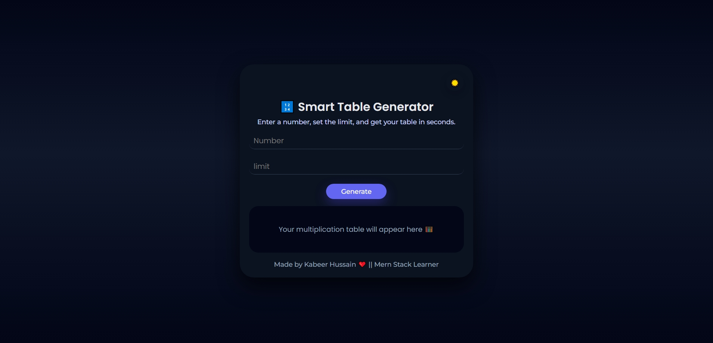

# 🔢 Smart Table Generator 
**Live Demo:** [TableCraft – Smart Tables](https://your-live-link-here.vercel.app/)

A **modern and responsive multiplication table generator** built using **HTML, CSS & JavaScript**.  
It allows users to generate tables instantly with **input validation**, **dark/light theme**, and a **clean professional UI**.

---

## 🚀 Features

### 🧮 Smart Table Generation

- Generate multiplication tables instantly  
- Custom **number** and **limit** input  
- Clean and readable result layout  

### ⚠️ Input Validation

- Empty input handling  
- Prevents zero (`0`) values  
- User-friendly error messages with visual feedback  

### 🌗 Theme System

- **Light / Dark theme toggle**
- Theme preference saved using **LocalStorage**
- Smooth transitions with CSS variables  

### 🎨 Modern UI Design

- Gradient background  
- Soft shadows & hover effects  
- Smooth focus and animation effects  
- Fully responsive on all devices  

---

## 🧩 How It Works

1. User enters a **number**
2. User sets a **limit**
3. Clicks **Generate**
4. Table is generated dynamically using JavaScript
5. Theme toggle 🌙 / ☀️ switches UI and saves preference

---

## 📁 Folder Structure

```text
smart-table-generator/
│── index.html
│── style.css
│── app.js
│── assets/
│   └── img/
│       └── favicon.webp
│── README.md
```

## 🛠️ Technologies Used

- HTML5
- CSS3 (CSS Variables & Dark Theme)
- Vanilla JavaScript (DOM Manipulation & LocalStorage)

---

## 🎯 Learning Goals

- DOM Manipulation
- Form Validation
- LocalStorage usage
- CSS Variables for theming
- Clean UI/UX practices
- JavaScript loops & logic

## 📸 Preview

**

---

## 🧪 Why This Project Is Special

- Beginner-friendly yet professional
- Real-world form validation practice
- Dark/Light theme implementation
- Clean, scalable structure
- Perfect for JavaScript portfolios

---

## 🛠️ Developer Info

👨‍💻 **Developer:** Kabeer Hussain  
📘 **Series:** JavaScript — 30 Days, 30 Projects  
📆 **Day:** ```css 12 — Smart Table Generator```  
📧 **Email:** codealpha0786@gmail.com  
🔗 **GitHub:** [ITechKabeer](https://github.com/ITechKabeer)

**⭐ If you like this project, don’t forget to star the repository**
Made by Kabeer Hussain ❤️ || Mern Stack Learner
